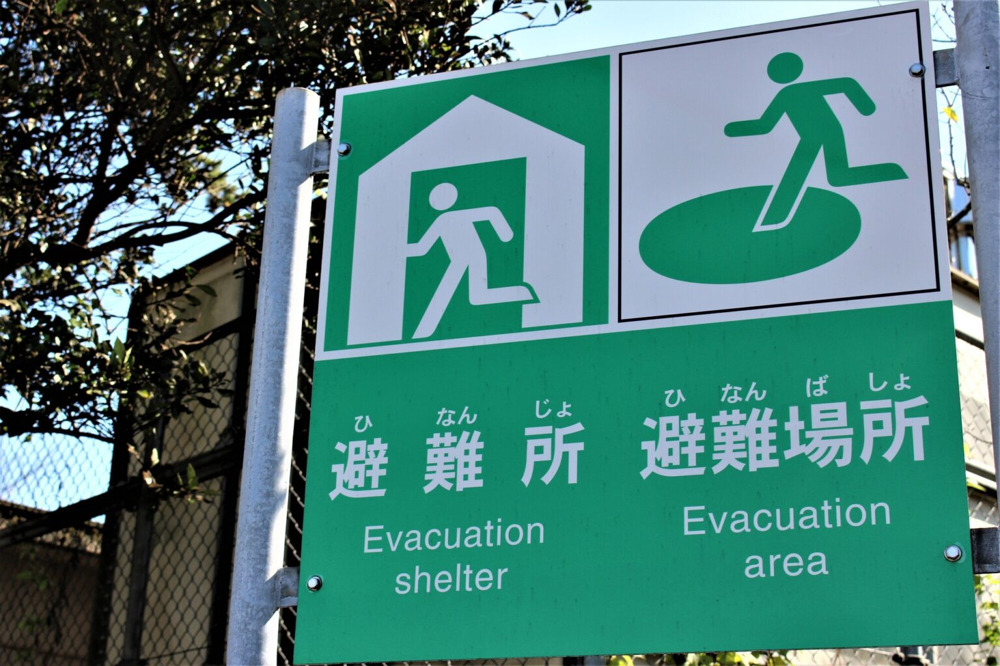

<PageTitle  
    title="緊急対応"
    subtitle="事件・災害・病気"
    :bg-image="japanBg"
    bgPos= "65% 35%"
/>

「緊急対応」とは、火災、自然災害、事故、急病、あるいはビジネス上の重大な障害など、生命や資産に危険が及ぶような「待ったなし」の事態に対し、迅速かつ適切に行動することを指します。

#### 
緊急電話番号（24 時間・無料）

まずはこの 3 つの番号を絶対に覚えておきましょう。

| 番号  | 内容                     | 使い方・備考                                     |
| ----- | ------------------------ | ------------------------------------------------ |
| 110   | 警察（事件・事故）       | `事件`にあった、`泥棒`が入った、`交通事故`など。 |
| 119   | 消防・救急（火事・急病） | `火事`か`救急`か聞かれます。                     |
| #7119 | 救急相談センター         | `救急車`を呼ぶべきか迷ったときに相談できます。   |

 

  

    

      言葉が不安なとき
    

    
    

    110 番も 119 番も、電話がつながったら「English, please」などと言えば、通訳センターを介した3 者通話（あなた・指令員・通訳者）に切り替えてくれます。
    

  

 

#### 
災害（地震・台風）への備え

日本は地震や台風が多い国です。以下の 3 点を準備しておきましょう。

    1
    
避難場所の確認

 

自宅や学校の近くにある「避難所」をハザードマップで確認しておいてください。

 

    2
    
防災バッグ

 

`水`、`食料`（3 日分）、`モバイルバッテリー`、`在留カードのコピー`、`現金`、`常備薬`などをリュックに入れておきます。

 

    3
    
情報収集アプリ

災害に備えるためには防災グッズを用意するだけでなく、防災アプリをダウンロードして情報収集ができるように準備しておくことが大切です。

| サービス名                                                                 | 特徴                                                     |
| -------------------------------------------------------------------------- | -------------------------------------------------------- |
| [Safety Tips](https://www.jnto.go.jp/safety-tips/eng/app.html)             | 観光庁監修、地震速報や避難勧告を多言語で通知             |
| [NHK WORLD-JAPAN](https://www3.nhk.or.jp/nhkworld/en/multilingual_links/)  | 災害ニュースを英語などで配信                             |
| [Yahoo! 防災速報](https://emg.yahoo.co.jp)                                 | 地震・台風・豪雨などの災害情報をプッシュ通知で受け取れる |
| [JMA（気象庁）アプリ](https://www.data.jma.go.jp/suishin/info/keitai.html) | 日本気象庁公式、地震・津波・台風情報を提供               |

 

    4
    
災害用伝言ダイヤル（171）

大規模な災害で電話がつながりにくいとき、家族や友人に安否（無事かどうか）を伝えるための仕組みです。

- 録音: `171` → `1` → `自分の電話番号` → メッセージを録音。
- 再生: `171` → `2` → `相手の電話番号` → メッセージを聞く。

 

#### 
夜間・休日の病気

夜間・休日の急病時は、まずこの 2 つの番号を絶対に覚えておきましょう

| 番号  | 相談窓口                 | 内容・役割                                                 |
| ----- | ------------------------ | ---------------------------------------------------------- |
| #7119 | 救急安心センターきょうと | 看護師が受診の必要性や対処法について助言してくれる。       |
| #8000 | 小児救急電話相談         | 小児科医・看護師が子どもの急病について相談に乗ってくれる。 |

 

医療情報ネット

[公式サイト](https://www.iryou.teikyouseido.mhlw.go.jp/znk-web/juminkanja/S2300/initialize)：厚生労働省が運営する日本全国の病院・診療所・薬局を検索できる

 

  

    

      外国語対応
    

    
    

    英語、中国語、韓国語など、特定の言語で診察が受けられる病院を絞り込めます
    

  

 

    

      今すぐ診る
    

    
    

    「夜間」「休日」に開いている病院や、救急外来を検索できます
    

  

  

    

      診療科目
    

    
    

      内科、眼科、歯科など、症状に合わせた専門医を見つけられます
    

  

