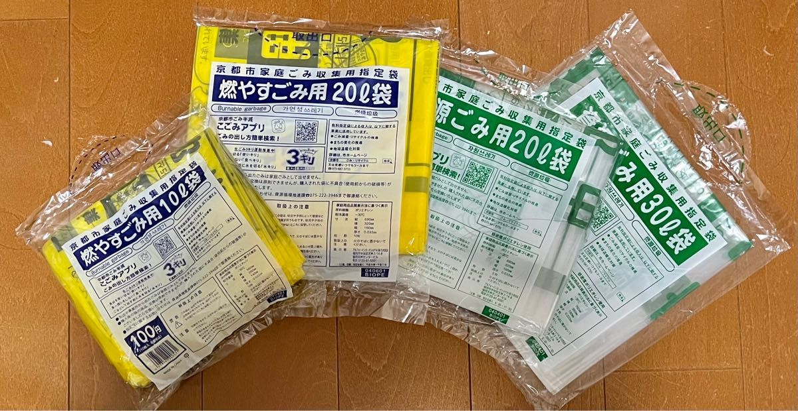
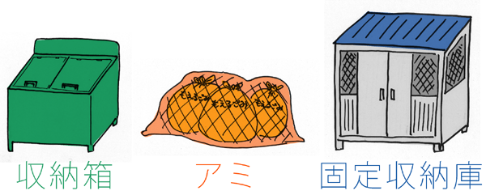
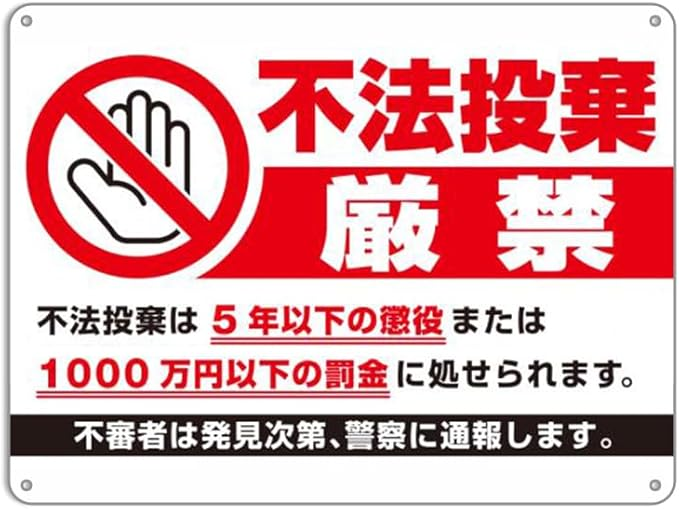

<PageTitle  
    title="Garbage sorting"
    subtitle="Classification・Rules・Penalties"
    :bg-image="japanBg"
    bgPos= "65% 45%"
/>

Waste disposal rules in Japan are extremely detailed by global standards, and rules can vary completely depending on the area where you live.

Failing to follow the correct procedures can lead to trouble with neighbors or landlords, and your trash might be left uncollected. Please pay close attention to local guidelines.

#### 
Basic Waste Categories

Generally, waste is divided into `4 to 6` categories. However, classification methods may differ by municipality.
 

| Category                 | Common Examples                                    | Instructions & Notes                            |
| ------------------------ | -------------------------------------------------- | ----------------------------------------------- |
| `Burnable` (Kanen)       | Food waste, soiled paper, clothing, wood products. | Drain excess liquids from food.                 |
| `Non-burnable` (Funen)   | Metal, glass, ceramics, small appliances.          | Wrap broken items and mark as "DANGER" (Kiken). |
| `Recyclables`            | PET bottles, cans, glass bottles, old paper.       | Rinse and dry before disposing.                 |
| `Plastic Waste`          | Food trays, wrappers, cups/containers.             | Check for the "pla" mark; rinse lightly.        |
| `Oversized` (Sodai Gomi) | Furniture, bicycles, futons.                       | Requires advanced application and a fee.        |
| `Hazardous/Dangerous`    | Batteries, fluorescent lights, spray cans.         | Use designated collection points.               |

 

  

    

      Details
    

    
    

      <a href='https://www.city.kyoto.lg.jp/menu1/category/1-3-9-0-0-0-0-0-0-0.html' style='color: white;'>Types of Waste (Kyoto City)</a>
    

  

 

#### 
The "3 Golden Rules" of Waste Disposal

Use "Designated Bags"

In many municipalities, waste will not be collected unless it is in official designated garbage bags, which are sold at supermarkets and convenience stores. Rules on whether you can use standard plastic shopping bags vary by region.

 

Follow "Days" and "Times"

 

 

Each category of waste has a specific collection day (e.g., "Mondays are for Burnable Waste").

Waste is generally put out by 8:00 AM on the day of collection. Putting trash out the night before is often prohibited as it can attract crows or become a fire hazard.

 

  

    

      Details
    

    
    

      <a href='https://www.city.kyoto.lg.jp/kankyo/page/0000000509.html' style='color: white;'>Collection Schedule Map (Kyoto City)</a>
    

  

 

Use the "Correct Location"

 

Take your trash to the designated "Collection Point" (Gomi-shukesyo). This may be a private area for your apartment or a shared "Gomi Station" for the neighborhood. Leaving trash on someone else's property because it is closer is considered a crime (Illegal Dumping).

 

Penalties and Trouble

 

 

Illegal dumping carries severe penalties. Dumping waste in forests, on roads, or on others' property is prohibited by law. Violators can face up to 5 years of imprisonment or fines of up to 10 million yen.

Furthermore, repeatedly ignoring disposal rules can lead to complaints from neighbors, which may result in your apartment lease being terminated.

 

#### 
Proper Disposal Methods (Crucial)

The "3R" Rules for Recyclables

Recyclable items (bottles, cans, etc.) must not be thrown away as-is. Follow these steps:
 

| Action  | Description                                                                                         |
| ------- | --------------------------------------------------------------------------------------------------- |
| Rinse   | Finish the contents and rinse lightly with water to prevent odors and dirt.                         |
| Remove  | Remove `caps` and `labels` from PET bottles. These are usually sorted as plastic resources.         |
| Recycle | Place the `bottle`, `cap`, and `label` into their respective designated bins or bags.               |
| Note    | Plastics with `unremovable dirt` (e.g., oily containers) are generally treated as "Burnable Waste." |

 

Handling Dangerous Items

These rules are essential to prevent fires and injuries at collection trucks or processing facilities.

 

| Type                       | Disposal Method / Notes                                                                                                    |
| -------------------------- | -------------------------------------------------------------------------------------------------------------------------- |
| Spray Cans / Gas Canisters | Must be `completely empty`. Shake to confirm there is no sound inside.                                                     |
| Batteries                  | `NEVER` mix with regular trash; they cause fires. Use `designated collection boxes` at electronics stores or supermarkets. |
| Blades / Broken Glass      | `Wrap` securely in cardboard or newspaper and clearly `mark` the bag as "`DANGER`" (Kiken).                                |

 

Organizing Paper Products

Magazines, newspapers, and cardboard should be tied in a cross with string rather than put in bags.
 

| Type                    | Disposal Method / Notes                                                                          |
| ----------------------- | ------------------------------------------------------------------------------------------------ |
| Cardboard               | Must be `flattened` before tying with string.                                                    |
| Small Paper (Zatsugami) | Collect `envelopes` and `flyers` in a paper bag or sandwich them between magazines before tying. |

 

#### 
What about Oversized Waste (Sodai Gomi)?

Furniture and appliances will never be collected if you simply leave them at the regular collection point. In Japan, disposing of large items requires a `reservation` and a `fee` (handling charge).

 

Furniture and Small Appliances

This applies to items where one side exceeds 30cm–50cm (e.g., futons, desks, chairs, bicycles, microwaves).

| Step              | Action                                                                                               |
| ----------------- | ---------------------------------------------------------------------------------------------------- |
| Application       | Apply via phone or internet to the `municipality's Oversized Waste Reception Center`                 |
| Details           | State the `type`, `size`, and `quantity` of the items.                                               |
| Confirmation      | You will be given a `collection date` and the `fee` amount.                                          |
| Purchase Stickers | Buy an `Oversized Waste Processing Ticket` (sticker) for the required amount at a convenience store. |
| Labeling          | Write your `name` or `reception number` on the sticker and attach it prominently to the item.        |
| Disposal          | Place the item outside your entrance or at the `designated spot` on the `scheduled` morning.         |

 

Appliances That Cannot Be Thrown Away

The following four types of appliances cannot be disposed of as oversized waste. Recycling is mandated by law.

`Refrigerators/Freezers`, `Washing Machines/Dryers`, `Televisions`,` Air Conditioners`

 

| Scenario      | Method / Cost                                                                        |
| ------------- | ------------------------------------------------------------------------------------ |
| Replacing     | Ask the store where you buy the new product to take back the old one.                |
| Disposal Only | Contact the store where you bought it or a local "Appliance Recycling Partner Shop." |
| Cost          | Typically ranges from ¥3,000 to ¥10,000 (Recycling fee + Transportation fee).        |

 

Ways to Give Away Items for Free

| Method                 | Description                                                                                            |
| ---------------------- | ------------------------------------------------------------------------------------------------------ |
| School Bulletin Boards | Post a notice saying, "I'm leaving Japan, so I'm giving away my refrigerator."                         |
| Recycle Shops          | If in good condition, they may buy it or pick it up for free (On-site appraisal)                       |
| Jimoty                 | A famous Japanese app for giving/trading items. If you give it away for free, you avoid disposal fees. |
