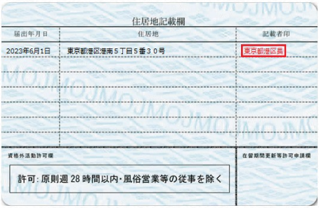

<PageTitle  
    title="垃圾分類"
    subtitle="分類・規則・罰則"
    :bg-image="japanBg"
    bgPos= "65% 45%"
/>

留学生在日本打工时，必须遵守“法律明定的规则”。若违反这些规则，可能会导致无法更新签证，甚至被强制遣返回国，请务必多加注意。

#### 
取得工作的“许可”

留学签证（在留资格：留学）的核心目的是学习，而非工作。在开始打工前，请务必确认在留卡背面的“资格外活动许可”栏位。

 

 

| 项目           | 内容                                                                               |
| :------------- | :--------------------------------------------------------------------------------- |
| 资格外活动许可 | 请确认护照或在留卡的`背面`是否盖有印章或注记。若无标示，须前往入国管理局进行申请。 |
| 学业优先       | 若学校`缺课过多`，即使持有资格外活动许可，也可能导致签证难以更新。                 |

 

#### 
绝对遵守“28 小时”限制

法律对于留学生在日本的工作时间有着严格的限制。

 

| 项目             | 内容                                                                      |
| :--------------- | :------------------------------------------------------------------------ |
| 每周 28 小时以内 | 所有工作的总计时数，`一周不得超过 28 小时`。                              |
| 同时兼差         | 若同时做 `2 份`以上的工作，合计时数也必须在 `28 小时`以内。               |
| 违反风险         | 即使`超过 1 分钟`也算违法（Overwork），未来可能面临无法在日本就职的风险。 |
| 长假期间         | 仅限在学校规定的长假期间，可以工作到`每日 8 小时（每周 40 小时）`。       |

 

#### 
禁止工作的场所（禁止从事风俗营业）

法律明文禁止留学生在以下场所工作。即使只是负责清洁或洗碗也绝对不可以。

 

`柏青哥店`、`游戏中心 (Game Center)`、`小酒馆 (Snack)`、`酒店 (Cabaret)`、`男模俱乐部 (Host Club)`、`酒吧`（以提供酒类为主且须接待客人的情况）、`麻将店`等。

 

在这些场所工作，即使持有资格外活动许可也属违法，且会面临“`强制遣返（回国）`”等非常严厉的处罚。

 

#### 
如何寻找打工机会

大多数留学生会通过以下渠道寻找工作：

 

| 寻找方式      | 内容                                                                                      |
| :------------ | :---------------------------------------------------------------------------------------- |
| 求职 APP      | 著名的有 `Townwork`、`Baitoru`、`Mynavi Baito` 等。 可使用“欢迎留学生”作为关键字搜索。 |
| 店面张贴海报  | 查看`便利商店`或`餐厅`门口的“Staff 募集”海报，并`直接致电`询问。                          |
| 学校介绍      | 大学的`生涯规划中心`或`事务局`有时会提供针对留学生的求职信息。                            |
| SNS・友人介绍 | 通过`学长姐`或`朋友`介绍，是相对安心的方法。                                              |

 

#### 
录取后应确认的事项

 

| 确认要点 | 内容                                                   |
| :------- | :----------------------------------------------------- |
| 时薪     | 确认是否未低于所居住地区的“`最低工资`”。               |
| 交通费   | 确认是否会支付补贴`电车`或`巴士`的`交通费用`。         |
| 发薪日   | 确认`每月几号`发薪，以及领取`方式`（通常为银行转账）。 |
