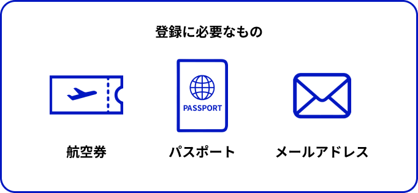

<PageTitle  
    title="来日前的準備"
    subtitle="必要的準備・注意事項"
    :bg-image="japanBg"
    bgPos= "65% 25%"
/>

 

簽證準備就緒後，接下來是為了讓日本生活順利展開的「來日前準備」。我們根據現況整理了重要的檢查清單。

### 
必備準備事項

建議提前 3 週開始準備

    1
    
重要物品與文件準備（隨身攜帶）

這些物品請勿放入託運行李，請務必隨身攜帶。

- `護照`與`簽證`

- `在留資格認定證明書` (COE)：入境審查時必需提供。

- `入學許可證`：有時會被要求出示以`證明學生身分`。

- `資格外活動許可申請書`：為了在機場能立即取得工讀許可，請事先填寫好。

- `現金`（日圓）：建議準備約 `5 萬至 10 萬`日圓 現金，用於抵達後的`交通費與餐費`（許多初期費用僅收現金，持有現金較為安心）。

- `照片`（數張）：申請學生證及辦理各項`行政手續`時會用到。

- `海外旅遊保險`（視需求準備）

- `國際駕照`（視需求準備）

 

    2
    
備用金錢與通訊準備

 

- 備用支付方式：`信用卡`、`海外匯款服務`

- 通訊手段：預約好日本國內用的`預付 SIM 卡`或 `eSIM`

 

    3
    
其他行李物品

 

- `衣物`：符合`日本季節`的衣服，特別是冬天的防寒衣物。

- `常備藥`：習慣使用的感冒藥或胃腸藥。

- `印章`（便印）：雖然近年來不需要印章的情況增加，但在開立銀行帳戶或簽署租房合約時仍可能`被要求使用`。雖然也可以在日本製作，但帶一個會更順利。

- `電腦`、`平板`：大學的報告、作業或線上課程的必需品。

- `轉接頭`：日本的插頭為 `A 型`。電壓為 100V，請確認您的電器產品是否支援。

- `母國的調味料`、`零食`：在剛開始不適應的環境中，這些物品在心情上會提供很大的支持。

- `充電器`、`行動電源`：為了防止「手機沒電」或「找不到充電地點」的情況，建議備有行動電源。

 

    4
    
Visit Japan Web 註冊

請於出發前幾天至[Visit Japan Web](https://services.digital.go.jp/visit-japan-web/) 完成註冊，並將 QR Code 截圖保存。

出典：Visit Japan Web

 

    5
    
在日住所

在入境審查（[Visit Japan Web](https://services.digital.go.jp/visit-japan-web/)）註冊時，必須輸入日本的`停留處地址`。

| 情況                 | 對應內容                     |
| -------------------- | ---------------------------- |
| 宿舍或租屋處已確定時 | 請備妥該`地址`與`電話號碼`。 |
| 尚未確定住所時       | 輸入前幾天`住宿酒店的地址`。 |

 

    

      注意事項
    

    
    

    <ul> 
    <li> 持留學簽證入境時，審查官可能會詢問「是要入住學校宿舍還是自行租屋」。請備妥學校提供的文件，以便隨時出示地址資訊。</li>
    </ul>
    

  

  

 

 

    6
    
入境與機內攜帶物品限制

較重或體積過大的行李，建議事先利用宅配服務寄送。

  

    

    參考網址
    

    
    

    <ul> 
    <li> <a href='https://www.ana.co.jp/ja/jp/international/prepare/baggage/checked-in/baggage-free.html' style='color: white;'>行李重量、尺寸、數量限制</a>（日文）</li>  
    <li> <a href='https://www.ana.co.jp/en/jp/international/prepare/baggage/checked-in/baggage-free.html' style='color: white;'>行李重量、尺寸、數量限制</a>（英文）</li>  
    <li> <a href='https://www.denver.us.emb-japan.go.jp/itpr_ja/jp_consular_mochikomijp.html' style='color: white;'>攜帶物品進入日本的相關限制</a></li>  
    </ul>
    

  

 

限制攜帶的物品

攜帶進入機內或於機場託運的行李中，部分物品受到限制。請務必事先確認。

  

    

    參考網址
    

    
    

    <ul> 
    <li> <a href='https://www.jal.co.jp/jp/ja/inter/baggage/limit/' style='color: white;'>受限制行李須知</a>（日文）</li>  
    <li> <a href='https://www.jal.co.jp/jp/en/inter/baggage/limit/' style='color: white;'>受限制行李須知</a>（英文）</li>  
    </ul>
    

  

