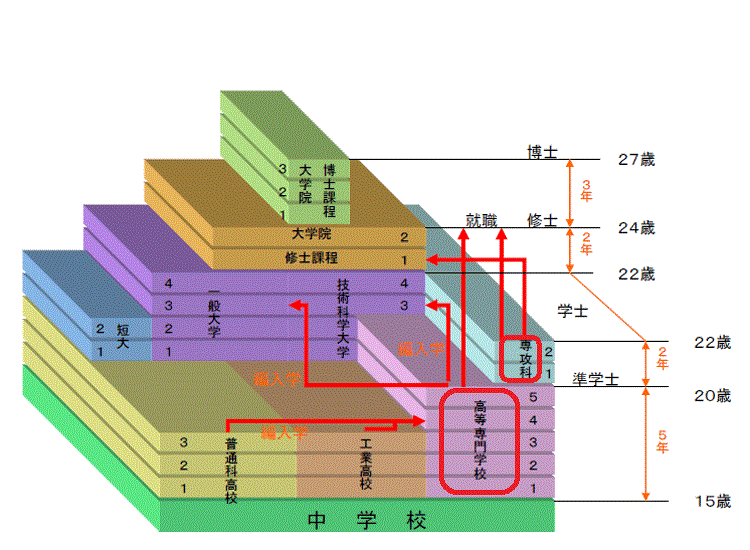

<PageTitle  
    title="教育系統制度"
    subtitle="從高校到大學院"
    :bg-image="japanBg"
    bgPos= "65% 35%"
/>

 

<h1 style="text-align: center;">日本高等教育概要</h1>

日本的高等教育始於完成初等教育（小學 6 年）及中等教育（國中 3 年、高中 3 年）共計 12 年的課程之後。

外國留學生若要進入日本的高等教育機關就讀，必須完成正規學校教育的第 12 年課程。

留學生可入學的高等教育機關主要分為以下 5 類，各類機關皆設有國立、公立與私立。專門學校絕大多數為私立，而大學中私立約佔了 7 成。

 

  

    

      高等教育機關
    

    
    

    <ul> 
    <li>  研究所 (大學院)</li>  
    <li>  大學（學部）、短期大學、專業職大學</li>
    <li>  專門學校、高等專門學校</li>
    </ul>
    

  

 

高專與高中、大學在制度上的關係

出處：文部科學省

高等教育機關數量

出處：「令和 4 年度學校基本調查」（文部科學省）

<table>
  <thead>
    <tr style="background-color: #2d2f31; color: #aaaaaa;">
      <th >教育機關</th>
      <th >国立</th>
      <th >公立</th>
      <th >私立</th>
      <th >總數</th>
    </tr>
  </thead>
  <tbody>
    <tr>
      <td style="font-weight: bold;">研究所 (大學院)</td>
      <td >86</td>
      <td >89</td>
      <td >482</td>
      <td >657</td>
    </tr>
    <tr>
      <td style="font-weight: bold;">大學（學部）</td>
      <td >86</td>
      <td >101</td>
      <td >620</td>
      <td >807</td>
    </tr>
    <tr>
      <td style="font-weight: bold;">短期大學</td>
      <td >0</td>
      <td >14</td>
      <td >295</td>
      <td >309</td>
    </tr>
    <tr>
      <td style="font-weight: bold;">高等專門學校</td>
      <td >51</td>
      <td >3</td>
      <td >3</td>
      <td >57</td>
    </tr>
    <tr>
      <td style="font-weight: bold;">専門學校</td>
      <td >8</td>
      <td >180</td>
      <td >2,533</td>
      <td >2,721</td>
    </tr>
  </tbody>
</table>

 

完成由獨立行政法人大學改革支援・學位授與機構（NIAD‐QE）認定之短期大學或高等專門學校「專攻科」課程者，向該機構提出申請並通過審查後，即可取得「學士」學位。詳情請向志願學校確認。

 

### 
高等教育機關介紹

#### 
研究所 (大學院)

這是大學（學士課程）畢業後，進一步研究高度且專業之學問理論及應用的教育機關。

許多研究所會在正式入學前，提供為期半年至 1 年的「研究生」準備期間。

此外，僅需使用英語即可取得學位的「全英文學位學程」也在持續增加中。

 

<table >
  <thead>
    <tr>
      <th>課程</th>
      <th>學位</th>
      <th>修業年限</th>
      <th>修得學分數</th>
    </tr>
  </thead>
  <tbody>
    <tr>
      <td >博士課程</td>
      <td >博士</td>
      <td >5年</td>
      <td>30學分以上 (包含碩士課程修得之學分)</td>
    </tr>
    <tr>
      <td >修士課程</td>
      <td >修士</td>
      <td >2年</td>
      <td >30學分以上</td>
    </tr>
    <tr>
      <td rowspan="3">専門職課程</td>
      <td >修士（専門職）</td>
      <td >2年</td>
      <td >30學分以上</td>
    </tr>
    <tr>
      <td >法務博士（専門職）</td>
      <td >3年</td>
      <td >93學分以上</td>
    </tr>
    <tr>
      <td >教職修士（専門職）</td>
      <td >2年</td>
      <td >45學分以上</td>
    </tr>
  </tbody>
</table>

 

  

    注意
  

  
    

  <ul>
  <li>根據研究所或學術領域的不同，有時會分為以下兩個階段：</li>
  <li>博士前期課程：最初的 2 年（相當於碩士課程）</li>
  <li>博士後期課程：剩餘的 3 年 </li>
  </ul>
  
  

 

#### 
大學（學部）

這是高中畢業者學習廣泛基礎知識與專業領域入門知識的高等教育機關。

多數大學要求學生在四年級時完成「畢業論文」或「畢業研究」，以證明其學習成果。

畢業後除了前往一般企業就業外，也可選擇進入「研究所 (碩士課程)」深造。

 

<table >
  <thead>
    <tr>
      <th>課程</th>
      <th>學位</th>
      <th>修業年限</th>
      <th>修得學分數</th>
    </tr>
  </thead>
  <tbody>
    <tr>
      <td >4年制 (一般學部・藥學部)</td>
      <td rowspan="2">學士</td>
      <td >4年</td>
      <td>124學分以上</td>
    </tr>
    <tr>
      <td >6年制 (醫學・齒學・獸醫學・藥學部)</td>
      <td >6年</td>
      <td >182學分以上</td>
    </tr>
  </tbody>
</table>

#### 
短期大學・專業職大學

專業職大學（2019 年創設的新大學制度）

短期大學、專業職大學、專業職短期大學雖然在重視實踐性職業教育這一點上是相通的，但在修業年限、目的與學位上有所不同。

這些機關能讓學生習得從事特定職業所需的知識、理論及實務技能。

在畢業所需的學分中，3 分之 1 以上是由實習或實作所構成。

<table >
  <thead>
    <tr>
      <th>學校類型</th>
      <th>學位</th>
      <th>修業年限</th>
      <th>修得學分數</th>
    </tr>
  </thead>
  <tbody>
    <tr>
      <td >専業職大学</td>
      <td >學士（専業職）</td>
      <td >4年</td>
      <td>124學分以上</td>
    </tr>
    <tr>
      <td >専門職短期大学</td>
      <td >短期大學士（専業職）</td>
      <td >2年或3年</td>
      <td rowspan='2'>2年課程：62學分以上 3年課程：93學分以上
      </td>
    </tr>
     <tr>
      <td >短期大学</td>
      <td >短期大學士</td>
      <td >2年或3年</td>
    </tr>
  </tbody>
</table>

 

#### 
高等專門學校・專門學校

 

其目的在於培育從事職業或實際生活所需的能力，或提升教養。

由於提供與特定職業直接相關的教育，因此通常具有較高的就業率。

 

<table >
  <thead>
    <tr>
      <th>學校類型</th>
      <th>對象</th>
      <th>課程</th>
      <th>學位</th>
      <th>修業年限</th>
    </tr>

  </thead>
  <tbody>
    <tr>
      <td >高等専門學校</td>
      <td >國中畢業生</td>
      <td ></td>
      <td >準學士</td>
      <td>5年或5年半</td>
    </tr>
    <tr>
      <td >専修學校 (専門學校)</td>
      <td rowspan='2'>高中畢業生</td>
      <td rowspan='2'>専門課程</td>
      <td >高度専門士</td>
      <td>4年</td>
    </tr>
     <tr>
      <td >短期大學</td>
      <td >専門士</td>
      <td >2年或3年</td>
    </tr>
  </tbody>
</table>

 

### 
高等教育標準年度日程（參考）

雖然日本教育機關採用國際化的秋季入學制度已日漸增多，但主流仍為「4 月入學」。

 

  

    

      學年度
    

    
    

      通常以 4 月 1 日至翌年 3 月 31 日為「1 學年」
    

  

 

    

      入學時期
    

    
    

          <ul> 
    <li>  4 月入學（最常見）</li>  
    <li>  秋季入學（9 月、10 月，針對留學生需求增加中）</li>
    </ul>
    

  

  

    

      學期制度
    

    
    

      多數高等教育機關採行學期制（二學期制）
    

  

  

    

      學期
    

    
    

    <ul> 
    <li>  春學期（前期）：4 月 ～ 9 月</li>
    <li>  秋學期（後期）：10 月 ～ 翌年 3 月</li>
    </ul>
    

  

    

      長期休暇
    

    
    

    <ul> 
    <li>  暑假：7 月下旬 ～ 9 月上旬</li>  
    <li> 寒假：12 月下旬 ～ 1 月上旬（年末年始）</li>
    <li> 春假：2 月 ～ 3 月（學年末假期）</li>
    </ul>
    

  

 

