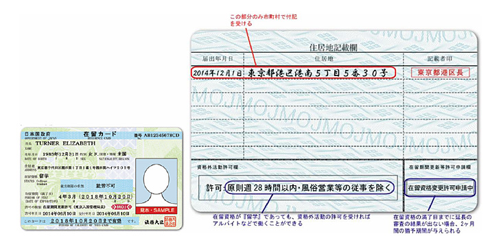
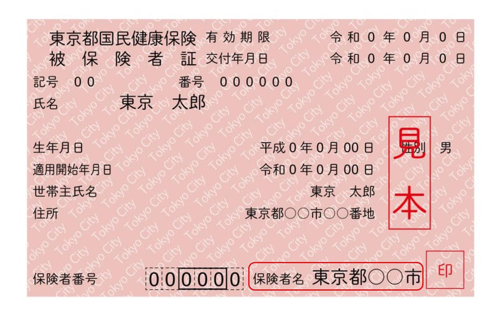

<PageTitle  
    title="住民登記"
    subtitle="市役所的流程"
    :bg-image="japanBg"
    bgPos= "65% 5%"
/>

在日本待超過 3 個月的外國人，必須在居住地的市（區）役所或支所（分所）辦理居住地登記。

 

#### 
住民登記（遷入屆）

確定居住地後 14 日內

住民登記是指由市區町村記錄並管理「居住在日本的人」的地址與家戶資訊（姓名、出生年月日等）。

  

    

      所需物品
    

    
    

    <ul> 
    <li> 在留卡（若機場未核發則持護照）</li>  
    <li> 護照</li>  
    </ul>
    

  

 

在留卡的背面，會在辦理住民登記（遷入、遷居）時，由市區町村窗口以手寫方式正式記載新地址。

 

住民票

建議在辦理住民登記時一併申請

「住民票」是證明在日本居住地點的公文書，記載有姓名、地址、出生年月日及性別等資訊。

在`開設銀行帳戶`、`簽約手機門號`、`打工`求職手續等許多場合，都會被要求提交住民票。

只要完成住民登記手續，即可立即申請核發。

 

搬家（變更地址）時

- 搬家後，必須在搬遷日起 14 日內，向新住處提交「遷入屆」或「遷居屆」。
- 若是在同一個市內搬家，則不需要向舊地址辦理申報。

  

    

      所需物品
    

    
    

    <ul> 
    <li> 在留卡</li>
    <li> 遷出證明書（重要）</li>
    <li> 國民健康保險證（僅限加入者）</li>
    <li> 個人編號通知卡或個人編號卡 (My Number Card)</li>
    </ul>
    

  

 

#### 
国國民健康保險 (National Health Insurance)

辦理住民登記時，可於同一公所窗口一併辦理

國民健康保險是日本的公定醫療保險制度。在日本在留 3 個月以上的外國人，必須強制加入。

加入國民健康保險後，雖然需要繳納國民健康保險費，但在醫院看病、接受治療時，醫療費的個人負擔原則上會降至 3 成（若未加入則須全額負擔）。

以月額來看，許多地區針對留學生的費用約落在 ¥1,500 〜 ¥2,500 左右（減免後金額）。

 

 

  

    

      詳細內容
    

    
    

    <ul> 
    <li> <a href='https://www.mhlw.go.jp/stf/seisakunitsuite/bunya/kenkou_iryou/iryouhoken/koukikourei/index_00002.html' style='color: white;'>國民健康保險制度（厚勞省）</a></li>
    </ul>
    

  

 

#### 
國民年金 (National Pension)

國民年金是為了在年邁等情況時提供所得保障的制度。居住在日本國內且年齡在 20 歲以上至 60 歲未滿的人，包含外國人在內，必須加入國民年金。

雖然必須加入，但針對學生，有保險費全額免除或繳納猶予（延後繳納）的制度（辦理手續時需要學生證）。

  

    

      詳細內容
    

    
    

    <ul> 
    <li> <a href='https://www.nenkin.go.jp/service/kokunen/menjo/20150428.html' style='color: white;'>國民年金保險費免除制度・繳納猶予制度</a></li>
    </ul>
    

  

