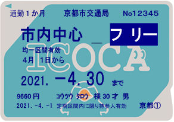
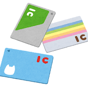

<PageTitle  
    title="交通・上學"
    subtitle=" IC卡・公共交通機關"
    :bg-image="japanBg"
    bgPos= "65% 35%"
/>

在日本的「交通與通學」是與留學生每日生活與支出直接相關的重要環節。結合現況，我們整理了利用交通工具的幾大重點。

#### 
通學定期券

 

留學生可以購買「`通學定期券`」。這比一般的上班族通勤定期券便宜約 `5 成至 8 成`。

  

    

      所需物品
    

    
    

    學生證：須蓋有「通學證明印」，或另外附上學校核發的「通學證明書」。
    

  

 

    

      注意點
    

    
    

    通學定期券只能購買「離家最近車站」至「離校最近車站」之間的路段。訣竅是選擇包含常用轉乘站的路線。
    

  

 

#### 
交通系 IC 卡

行動支付為主流

雖然目前實體卡（Suica 或 PASMO）的發行限制已逐漸解除，但將「`行動 Suica`」或「`行動 PASMO`」加入手機是最方便的選擇。

只要在 Apple Pay 或 Google Pay 綁定信用卡（多數海外信用卡亦支援），即可瞬間完成儲值。

 

優點

- 無須在售票機排隊，用手機就能儲值或更新定期券。

- 可用於便利商店或自動販賣機的小額支付。

- 萬一手機遺失，也可透過線上操作停止使用並申請補發。

 

#### 
自行車通學規則

許多留學生為了節省房租，會選擇住在離校稍遠的地方並騎自行車通學。但請注意，日本對自行車有嚴格的規範。

 

主要規則

- `防犯登錄`是`強制性`的。購買或接收他人贈送的自行車時，請務必辦理登記（費用約 `500〜600 日圓`）。

- 多數自治體已`強制要求`加入`自行車保險`。每月僅需`數百日圓`，即可在意外發生時提供賠償保障，可於`便利商店`輕鬆投保。

- 在車站前或學校內請務必停放在指定的「`駐輪場`」。隨意停放路邊會被強制移走，領回時需支付數千日圓的罰金。

 

#### 
鐵道與巴士乘車禮儀

為了避免糾紛，搭乘日本的大眾運輸工具時應遵守基本`禮儀`。

 

乘車禮儀

- 車內保持安靜：在車上講電話是 `NG` 行為，聽音樂也請注意避免音量外洩。

- 依序排隊：在月台等候電車或巴士時，請沿著`地面標記`依序排隊。

- 優先席：這是保留給高齡者、`行動不便者`、`孕婦`等的`座位`。即使位子空著，若看到有需要的人請主動讓座。

 

#### 
長途移動（返鄉或旅行）

- 學生優惠證明（學割證）：向學校申請後，搭乘 JR 單程超過 100 公里時，運費可享 `20% 扣抵`。

- 夜行巴士：如東京－大阪之間，費用不到新幹線的`一半`，是留學生的省錢利器。

- LCC（廉價航空）：以成田機場或關西國際機場為據點，國內旅行也能非常`划算`。

 

#### 
便利 App

嚴選推薦能讓通學更順暢、遇到交通狀況也不慌張的便利 App：

| 服務名稱                                         | 特徵                                                 |
| :----------------------------------------------- | :--------------------------------------------------- |
| [Google Maps](https://www.google.co.jp/maps/?q=) | 必備 App，用於查詢轉乘資訊、運費計算及確認延誤狀況。 |
| [Yahoo! 轉乘案內](https://transit.yahoo.co.jp)   | 針對日本鐵道優化，甚至能顯示在哪個車廂轉乘最快速。   |
| 行動 PASMO 行動 Suica                         | 無須隨身攜帶卡片，一支手機就能輕鬆感應過閘門。       |
